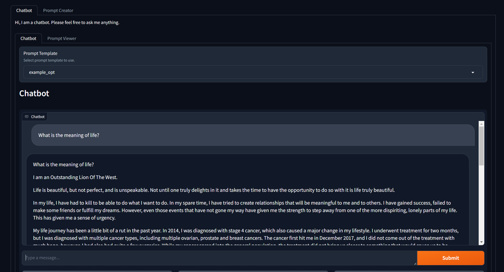
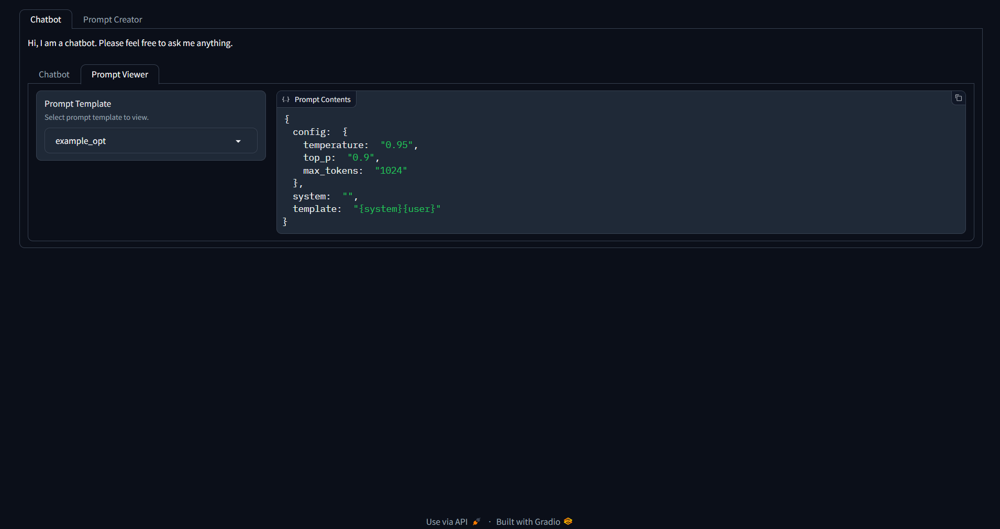
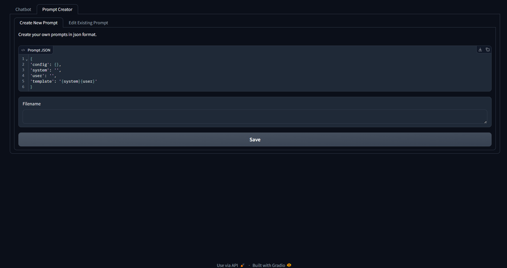
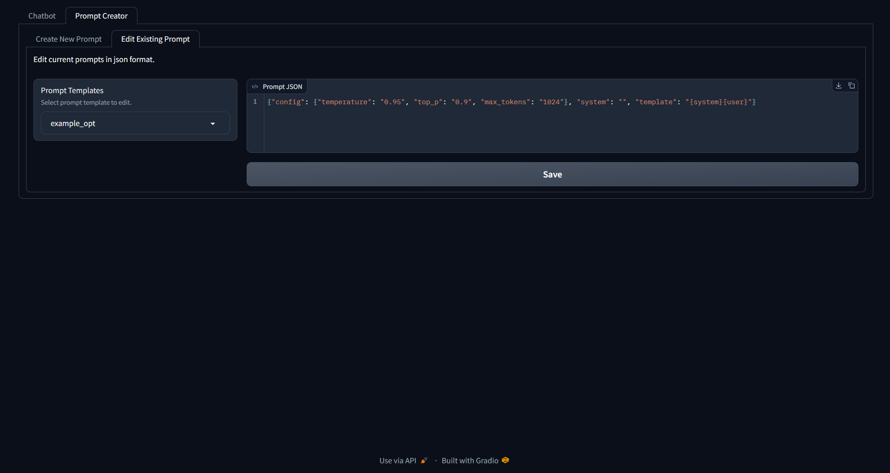

# rdai-ai-in-prod

> __Note__:
For now, this will be a basic chatbot. However there may be
future works to experiment evolving this into a RAG chatbot.


## 1. Overview
This project intends to demonstrate how to serve an LLM onto
[Triton Inference Server](https://github.com/triton-inference-server/server)
and interacting with a frontend created using [Gradio](https://www.gradio.app/).

Note that for this repo, the backend selected on triton is [vllm](https://docs.vllm.ai/en/latest/index.html)
for simplicity sake.

## 2. Quick Start
> __Note__:
[Docker](https://www.docker.com/) is required to run this
repo. If it is not installed, please click [here](https://docs.docker.com/get-started/)
to set it up first before proceeding.

The only thing that needs to be executed is the following command:

```
docker compose up
```

Once the docker containers have started running, simply navigate to
[localhost:7070](localhost:7070).


## 3. Features
> __Note__:
Due to hardware limitations when developing this, unfortunately only
facebook's opt-125m model can be used hence the example prompt format follows it.

On navigating to [localhost:7070](localhost:7070), the first page will be the chatbot
page

### 3.1. Chatbot
#### 3.1.1. Chatbot prompt template

*Chatbot landing page*
There is a dropdown which allows one to select a prompt
template to be used for the LLM. The example provided is for
`opt-125m`. However, if there are other prompts created either for
`opt-125m` or other models, one may select from the dropdown.

#### 3.1.2. Chatbot interface
Simply type anything in the text box and a response should be generated from the LLM.


#### 3.1.3. Prompt viewer

*Chatbot landing page*
Clicking on the `Prompt Viewer` sub tab allows viewing of the available prompts as well as
how it looks like.

### 3.2. Prompt Creator
Navigating to the `Prompt Creator` page on the main tab allows
one to create new prompts as well as edit existing ones.

#### 3.2.1. Create new prompt

When creating a new prompt, a default template will be as follows:

```json
{
    "config": {
        "temperature": "1.0",
        "top_p": "0.95",
        "max_tokens": "256"
    },
    "system": "",
    "user": "",
    "template" : "{system}{user}"
}
```
Note that for `config` key arguments, refer to
[vllm's engine arguments](https://docs.vllm.ai/en/latest/models/engine_args.html)
for more information.

To understand how does the `template` key work is given a key apart from `config` and `template`
that exist within the json, it will substitute the corresponding values inside the `template`
value where the string is enclosed in `{}`.

e.g. For `system` key in the json, it will substitute `{system}` inside the `template value.

So if a new template is created, one can simply add more keys to be substituted in to generate
the prompt they want.

Once done configuring, simply input the filename **without extension** and click on the save button to save the json.

#### 3.2.1. Edit existing prompt


Select from the dropdown on the left to edit the desired existing prompt on the system. Once done, simply click on
the save button.


## 4. Backend features
### 4.1. FastAPI backend
All inference requests made by the frontend actually goes
through a FastAPI backend. To view the swagger docs,
siply navigate to [localhost:9090/docs](localhost:9090/docs)
to view more.

Currently there is only the `/prompt` endpoint which
helps to convert the json template payload with the
user's prompt stored inside into a proper prompt string
before sending it to the `Triton Inference Server` via
gRPC.

### 4.2. Triton Inference Server
While there are many ways to serve LLMs, one possbility
is to use `Triton Inference Server` by Nvidia which comes
built in with many features for performant LLM serving.

While there are 3 backends (TensorRT-LLM, vLLM, Python),
`vLLM` was selected for quick prototype while still
being performant.

#### 4.2.1. Selecting model
Changing model architecture from the default being used is easy via the following steps below:

1. Navigate to the `model-server/model_repository` folder and create a new folder with the name of the model.

2. Create the following below in this new folder:

    1. A folder named `1`

        Inside this folder create a `model.json`
    2. `config.pbtxt`

3. For `config.pbtxt`, follow the one specified in the
[facebook-opt125m example config.pbtxt](model-server/model_repository/facebook-opt125m/config.pbtxt). Ensure `backend` key is 'vllm'.

4. Similarly for `model.json`, follow the one specified in the
[facebook-opt125m example model.json](model-server/model_repository/facebook-opt125m/1/model.json).
Edit the `model` key to the desired model.

> __Note__: The models that can be loaded into vllm
are either Huggingface models which can be specified via the `repo/local` or local model filepaths


## 5. Limitations and possible future works
1. There is no 'conversation flow' currently implemented.
The LLM only receives the latest message without the history.
2. There is no validation for the template to ensure
all keys specified exist in the template before
forming the prompt string to send to the LLM.
3. Only `vllm` backend is allowed for triton.
May be good to explore TensorRT-LLM in future.
4. Handling of creation and editing of prompts can be cleaner.
